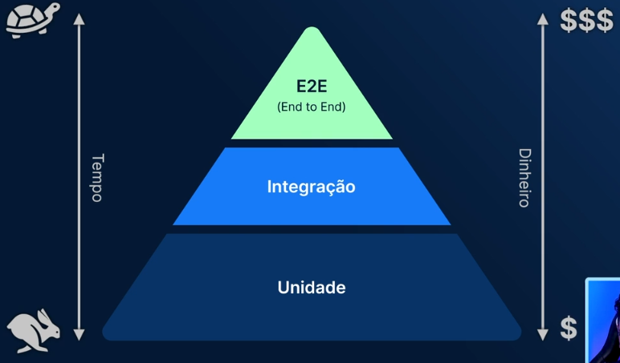

# Piramides de Testes

## Testes de Unidade (ou testes unitários)

São os testes mais rápidos e baratos de serem feitos, eles testam uma pequena unidade do software, como uma função ou utilitário que geralmente executam uma tarefa.

## Testes de Integração

São testes um pouco mais complexos do que os testes unitários, eles testam como partes da aplicação trabalham em conjunto.

## Testes E2E (End to End)

Os testes E2E são os testes que testam a aplicação por completo.

## Para saber mais

[Tipos de testes: Quais os principais e por que utilizá-los](https://www.alura.com.br/artigos/tipos-de-testes-principais-por-que-utiliza-los)

[Testes de acessibilidade](https://qatainarareis.medium.com/teste-de-acessibilidade-b71085facb5c)

## Testes Assíncronos

Os testes assíncronos são usados quando você faz a requisição para uma API e espera a promisse ser resolvida para executar o teste.
Para isso utilize o método `findBy()` ou `findAllBy()`, que utiliza os métodos `waitFor()` com o `getBy()`.
[Para saber mais sobre métodos async](https://testing-library.com/docs/dom-testing-library/api-async/)
